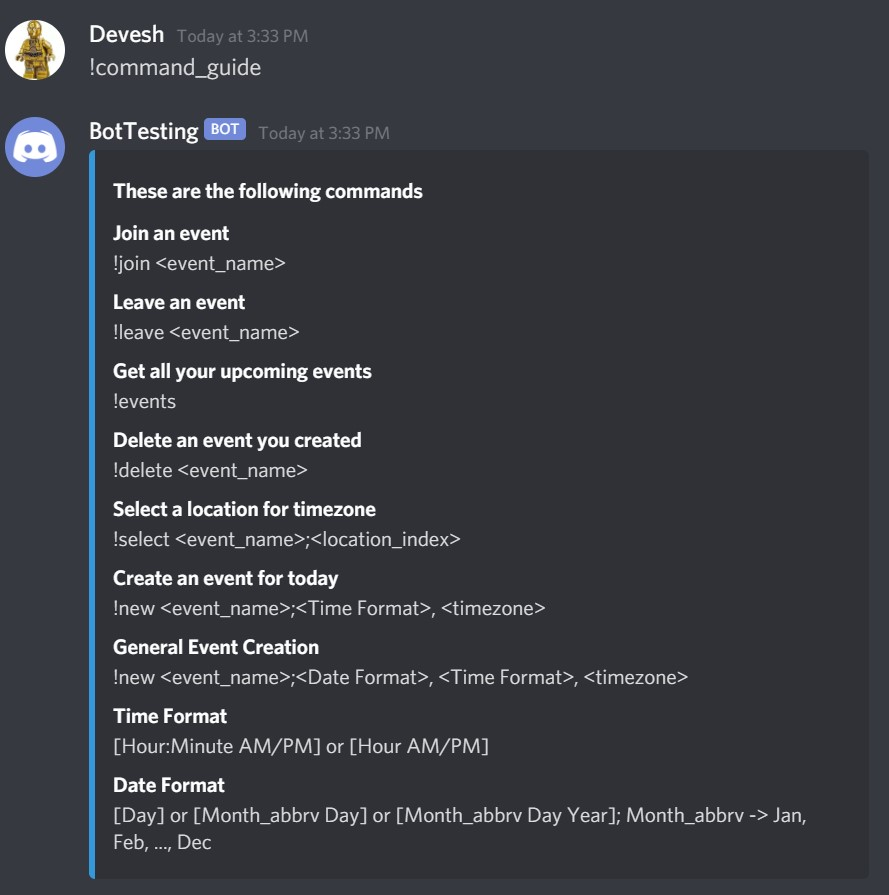

# DiscordEventBot
A discord bot to help server member to create and get reminders about upcoming events. 

## Details 
Any user of the server can create a new event like "Game Night" and then the other server members can join the event if
they want. Then 15 minutes before the event starts, members who indicated that they were intrested will get a message
from the bot reminding them that the event is about to start. 

##Command Guide
Here is a guide on the commands that can be called on the bot: 
